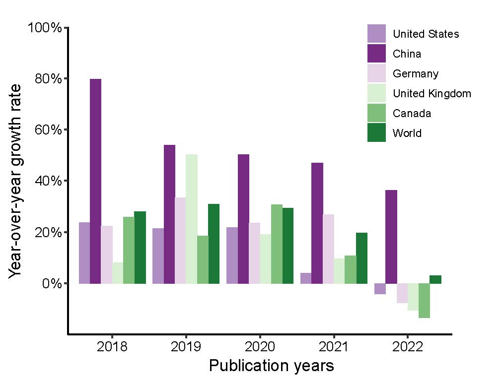

```{r setup, include = FALSE}
knitr::opts_chunk$set(
  collapse  =  T, echo = T, comment = "#>", message = F, warning = F,
	fig.align  =  "center", fig.width  =  5, fig.height = 3, dpi = 150)
```

If you use this script, please cited 如果你使用本代码，请引用：

Yunyun Gao, Danyi Li, Yong-Xin Liu, Microbiome research outlook: past, present, and future, Protein & Cell, 2023, pwad031, https://doi.org/10.1093/procel/pwad031. 

# Bar plot



图. 目标示例，图1c


# Create a sample data frame

```{r}
df <- read.table("Figure1cBarplot.txt", header = TRUE, sep = "\t")

```
# R Package Loading

```{r install, echo = TRUE}
library(tidyr)
library(ggplot2)
```

# Set the Year column as a factor to ensure the x-axis is ordered correctly

```{r parameter}
df$Year <- factor(df$Year, levels = unique(df$Year))
# Convert the data frame to long format
df_long <- pivot_longer(df, -Year, names_to = "Country", values_to = "Growth_Rate")
```


# Set the levels of the "Country" factor in the desired order
```{r readdata}
df_long$Country <- factor(df_long$Country, levels = c("United_States", "China", "Germany", "United_Kingdom", "Canada", "World"))

```

# Create the barplot

```{r}

p=ggplot(df_long, aes(x = Year, y = Growth_Rate, fill = Country)) +
  geom_bar(stat = "identity", position = "dodge") +
  labs(title = "Growth Rate of Different Countries",
       x = "Year", y = "Growth Rate", fill = "Country") +
  scale_fill_manual(values = c( "#af8dc3","#762a83","#e7d4e8", "#d9f0d3", "#7fbf7b", "#1b7837"))


p+labs(x = "Publication Years", y = "YoY Growth rate") +  # Add this line
  scale_y_continuous(expand = c(0,0),limits = c(-20,100),breaks = seq(0, 100, by = 20)) +
  theme_classic() +
  theme(
    panel.background = element_rect(fill="white", colour="white", size=0.25),
    axis.line = element_line(colour="black", size=0.5),
    axis.title = element_text(size=10, color="black"),
    axis.text = element_text(size=10, color="black"),
    legend.position = c(0.9, 0.8),
    legend.text = element_text(size =10),
    aspect.ratio = 0.8,  # set figure size to 8x6 inches
    plot.title = element_text(size = 10)
  ) 
```

If you use this script, please cited 如果你使用本代码，请引用：

Yunyun Gao, Danyi Li, Yong-Xin Liu, Microbiome research outlook: past, present, and future, Protein & Cell, 2023, pwad031, https://doi.org/10.1093/procel/pwad031. 

Copyright 2016-2023 Yunyun Gao(高云云), Yong-Xin Liu(刘永鑫) <liuyongxin@caas.cn>, Agricultural Genomics Institute at Shenzhen, Chinese Academy of Agricultural Sciences
