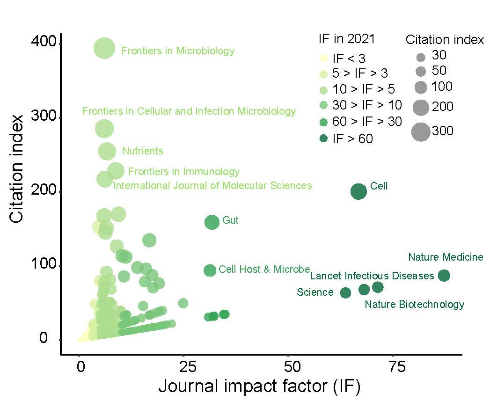

```{r setup, include = FALSE}
knitr::opts_chunk$set(
  collapse  =  T, echo = T, comment = "#>", message = F, warning = F,
	fig.align  =  "center", fig.width  =  5, fig.height = 3, dpi = 150)
```

If you use this script, please cited 如果你使用本代码，请引用：

Yunyun Gao, Danyi Li, Yong-xin Liu. Microbiome research outlook: past, present, and future. 

# Bar plot



图. 目标示例，图1d


# Read in data

```{r}
mydata <- read.table("Figure1dBubbleplot.txt", header = TRUE, sep = "\t")
```
# R Package Loading

```{r install, echo = TRUE}

library(ggplot2)
```

# Create a color palette for the data types

```{r parameter}
mycolors <- c("<3" = "#ffffbf", ">3"="#d9f0a3",">5" = "#addd8e", ">10" = "#78c679", ">30" = "#31a354", ">60" = "#006837")


```

# create the bubble chart

```{r}
p = ggplot(mydata, aes(x = IF, y = index, size = index, color = type)) +
  geom_point(alpha = 0.8) +
  scale_color_manual(values = mycolors, 
                     limits = c("<3",">3", ">5", ">10", ">30", ">60")) + # specify the legend order
  scale_size(range = c(2, 15), breaks = c(30, 50, 100, 200, 300), 
             labels = c(30, 50, 100, 200, 300)) +
  xlab("Journal IF") +
  ylab("Citation index") +
  guides(
    color = guide_legend(
      title = "IF in 2021", 
      override.aes = list(size=5),
      direction = "vertical",    # change the direction of color legend to horizontal
      label.position = "right", # place the labels on the right
      title.position = "top"
    ),
    size = guide_legend(
      title = "Citation index", 
      override.aes = list(color = "grey50"),
      direction = "vertical",      # change the direction of size legend to vertical
      label.position = "right",     # place the labels on the right
      title.position = "top"
    )
  )

p+theme_classic() +
  theme(
    panel.background = element_rect(fill="white", colour="white", size=0.25),
    axis.line = element_line(colour="black", size=0.5),
    axis.title = element_text(size=13, color="black"),
    axis.text = element_text(size=12, color="black"),
    aspect.ratio = 0.8,
    legend.position = c(0.95, 0.65), # set position of color legend
  )


```

If you use this script, please cited 如果你使用本代码，请引用：

Yunyun Gao, Danyi Li, Yong-xin Liu. Microbiome research outlook: past, present, and future. 

Copyright 2016-2023 Yunyun Gao(高云云), Yong-Xin Liu(刘永鑫) <liuyongxin@caas.cn>, Agricultural Genomics Institute at Shenzhen, Chinese Academy of Agricultural Sciences
