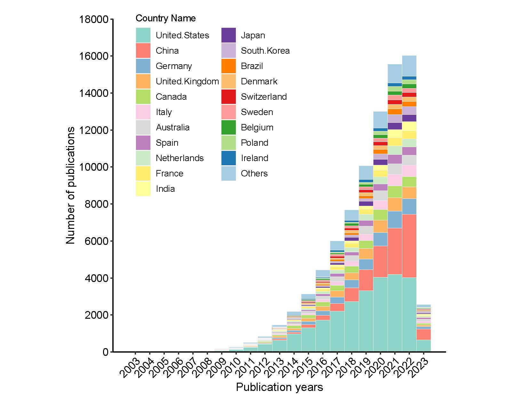

```{r setup, include = FALSE}
knitr::opts_chunk$set(
  collapse  =  T, echo = T, comment = "#>", message = F, warning = F,
	fig.align  =  "center", fig.width  =  5, fig.height = 3, dpi = 150)
```

If you use this script, please cited 如果你使用本代码，请引用：

Yunyun Gao, Danyi Li, Yong-xin Liu. Microbiome research outlook: past, present, and future. 

# Bar plot



图. 目标示例，图S1a


# Read in data

```{r}
mydata<- read.table("FigureS1aBarplot.txt", header = T, sep='\t')

```
# R Package Loading

```{r install, echo = TRUE}
library(ggplot2)
library(reshape2)
library(RColorBrewer)
library(scales)
library(ggnewscale)

```

# Convert the data frame

```{r parameter}
data<-melt(mydata,id.vars = 'ID')

```


# Create the barplot

```{r}
p <- ggplot(data=data,aes(ID,value,fill=variable)) +
  geom_bar(stat="identity",position="stack", color="#f0f0f0", width=1,size=0.25) +
  scale_fill_manual(values=c("#a6cee3","#1f78b4","#b2df8a","#33a02c","#fb9a99",
                                      "#e31a1c","#fdbf6f","#ff7f00","#cab2d6",
                                      "#6a3d9a","#ffff99","#ffed6f","#ccebc5",
                                      "#bc80bd","#d9d9d9","#fccde5","#b3de69",
                                      "#fdb462","#80b1d3","#fb8072","#8dd3c7"))


                                      
p+labs(x = "Publication years", y = "Number of publications") +
  scale_x_continuous(breaks = seq(min(data$ID), max(data$ID), by = 1)) +  # Add this line
  scale_y_continuous(expand = c(0,0),limits = c(0,18000),breaks = seq(0, 18000, by = 2000)) +
  theme_classic() +
  theme(
    panel.background = element_rect(fill="white", colour="white", size=0.25),
    axis.line = element_line(colour="black", size=0.5),
    axis.title = element_text(size=13, color="black"),
    axis.text = element_text(size=12, color="black"),
    legend.position = c(0.35, 0.7),
    legend.text = element_text(size =10),
    aspect.ratio = 1,  # set figure size to 8x6 inches
    plot.title = element_text(size = 10), # optional, add a title
    axis.text.x = element_text(angle = 45, hjust = 1) # Rotate x-axis labels by 45 degrees
  ) +
  guides(fill = guide_legend(reverse = TRUE))
```

If you use this script, please cited 如果你使用本代码，请引用：

Yunyun Gao, Danyi Li, Yong-xin Liu. Microbiome research outlook: past, present, and future. 

Copyright 2016-2023 Yunyun Gao(高云云), Yong-Xin Liu(刘永鑫) <liuyongxin@caas.cn>, Agricultural Genomics Institute at Shenzhen, Chinese Academy of Agricultural Sciences
