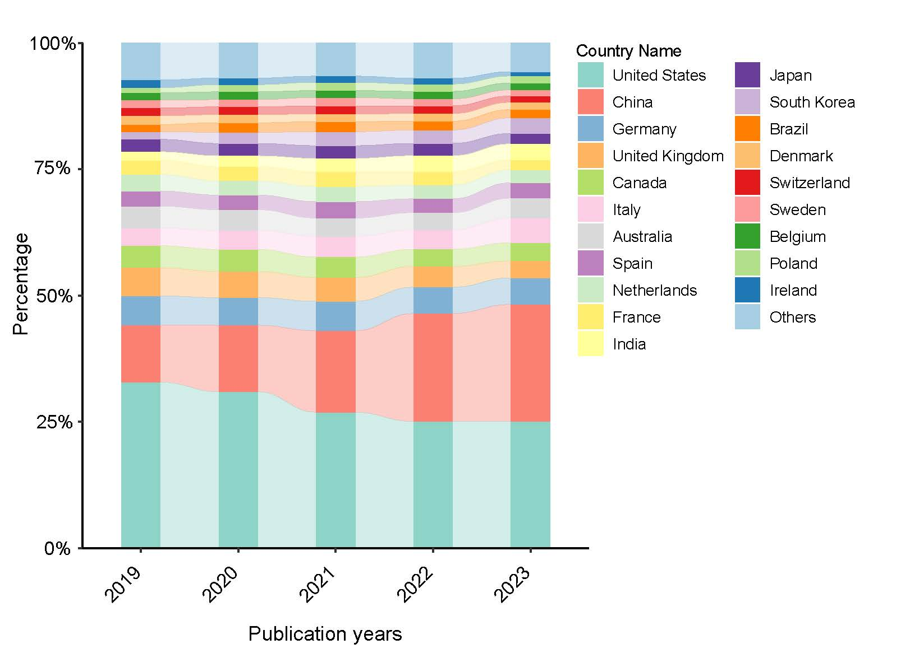

```{r setup, include = FALSE}
knitr::opts_chunk$set(
  collapse  =  T, echo = T, comment = "#>", message = F, warning = F,
	fig.align  =  "center", fig.width  =  5, fig.height = 3, dpi = 150)
```

If you use this script, please cited 如果你使用本代码，请引用：

Yunyun Gao, Danyi Li, Yong-Xin Liu, Microbiome research outlook: past, present, and future, Protein & Cell, 2023, pwad031, https://doi.org/10.1093/procel/pwad031. 

#Bar plot



图. 目标示例，图S1b


#Read in data

```{r}

mydata<- read.table("FigureS1bBarplotWithLine.txt", header = T, sep='\t')

```
#R Package Loading

```{r install, echo = TRUE}

library(readxl)
library(ggplot2)
library(tidyr)
library(ggalluvial)
library(alluvial)

```


#Define the desired order of levels for the ID variable

```{r parameter}
#Convert the data frame
test1 <- gather(mydata, E1, E2, -ID) 

my_order<- c("Others","Ireland","Poland","Belgium","Sweden","Switzerland","Denmark","Brazil","South Korea","Japan","India","France","Netherlands","Spain","Australia","Italy","Canada","United Kingdom","Germany","China","United States")


# Use the factor() function to reorder the levels of the ID variable
test1$ID <- factor(test1$ID, levels = my_order)

```


#Create the barplot

```{r}

ggplot(test1, aes(x=E1, y=E2,alluvium = ID)) + 
  geom_alluvium(aes(fill= ID),
                alpha= 0.4, width = 0.4) +
  geom_bar(stat="identity",aes(fill=ID), width = 0.4) +
  scale_y_continuous(expand = c(0,0)) +
  scale_fill_manual(values=c("#a6cee3","#1f78b4","#b2df8a","#33a02c","#fb9a99",
                                      "#e31a1c","#fdbf6f","#ff7f00","#cab2d6",
                                      "#6a3d9a","#ffff99","#ffed6f","#ccebc5",
                                      "#bc80bd","#d9d9d9","#fccde5","#b3de69",
                                      "#fdb462","#80b1d3","#fb8072","#8dd3c7"))+
                                        theme_classic() +
  theme(
    panel.background = element_rect(fill="white", colour="white", size=0.25),
    axis.line = element_line(colour="black", size=0.5),
    axis.title = element_text(size=13, color="black"),
    axis.text = element_text(size=12, color="black"),
    legend.text = element_text(size =10),
    aspect.ratio = 1,  # set figure size to 8x6 inches
    plot.title = element_text(size = 10), # optional, add a title
    axis.text.x = element_text(angle = 45, hjust = 1) # Rotate x-axis labels by 45 degrees
  ) +
  guides(fill = guide_legend(reverse = TRUE))

```

If you use this script, please cited 如果你使用本代码，请引用：

Yunyun Gao, Danyi Li, Yong-Xin Liu, Microbiome research outlook: past, present, and future, Protein & Cell, 2023, pwad031, https://doi.org/10.1093/procel/pwad031. 

Copyright 2016-2023 Yunyun Gao(高云云), Yong-Xin Liu(刘永鑫) <liuyongxin@caas.cn>, Agricultural Genomics Institute at Shenzhen, Chinese Academy of Agricultural Sciences
