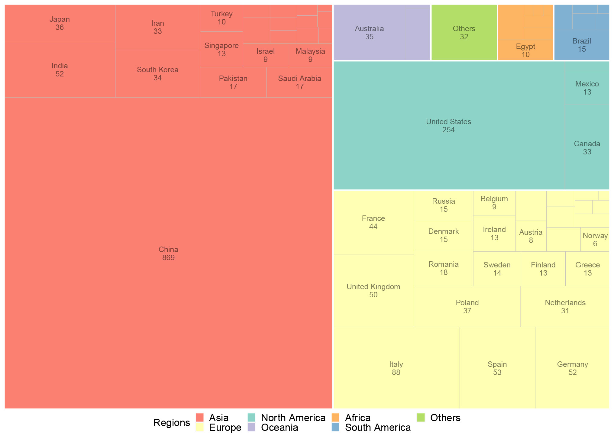

```{r setup, include = FALSE}
knitr::opts_chunk$set(
  collapse  =  T, echo = T, comment = "#>", message = F, warning = F,
	fig.align  =  "center", fig.width  =  5, fig.height = 3, dpi = 150)
```

If you use this script, please cited 如果你使用本代码，请引用：

Yunyun Gao, Danyi Li, Yong-Xin Liu, Microbiome research outlook: past, present, and future, Protein & Cell, 2023, pwad031, https://doi.org/10.1093/procel/pwad031. 

#Bar plot



图. 目标示例，图S2a


#Read in data

```{r}

mydata<- read.table("FigureS2ATreeMap.txt", header = T, sep='\t')

```
#R Package Loading

```{r install, echo = TRUE}

library(ggplot2)
library(treemapify)

```

# Define the desired order of legends

```{r parameter}
legend_order <- c("Asia",  "Europe", "North America","Oceania","Africa", "South America",  "Others")

```

# Plotting TreeMap Graph

```{r}

ggplot(mydata, aes(area = NumberOfPublication, fill = Regions,
                 label = paste0(Places, "\n", NumberOfPublication), subgroup = Regions)) +
  geom_treemap(layout = "squarified") +
  geom_treemap_text(place = "centre", size = 12, family = "sans", min.size = 12, alpha = 0.5, colour = 'black') +
  geom_treemap_subgroup_border(colour = "white", size = 3)+
  scale_fill_manual(values = c("#fb8072", "#ffffb3", "#8dd3c7", "#bebada", "#fdb462", "#80b1d3", "#b3de69"),
                    breaks = legend_order) +
  labs(fill = "Regions") +
  theme(legend.position = "bottom",
        legend.text = element_text(size = 16),
        legend.title = element_text(size = 16),
        legend.key.height = unit(0.5, "cm"),
        legend.key.width = unit(0.5, "cm"),
        legend.direction = "horizontal",
        legend.box = "horizontal",
        legend.box.just = "center",
        legend.box.spacing = unit(0.2, "cm"),
        legend.margin = margin(t = 0, r = 0, b = 0, l = 0)) 
```

If you use this script, please cited 如果你使用本代码，请引用：

Yunyun Gao, Danyi Li, Yong-Xin Liu, Microbiome research outlook: past, present, and future, Protein & Cell, 2023, pwad031, https://doi.org/10.1093/procel/pwad031. 

Copyright 2016-2023 Yunyun Gao(高云云), Yong-Xin Liu(刘永鑫) <liuyongxin@caas.cn>, Agricultural Genomics Institute at Shenzhen, Chinese Academy of Agricultural Sciences
